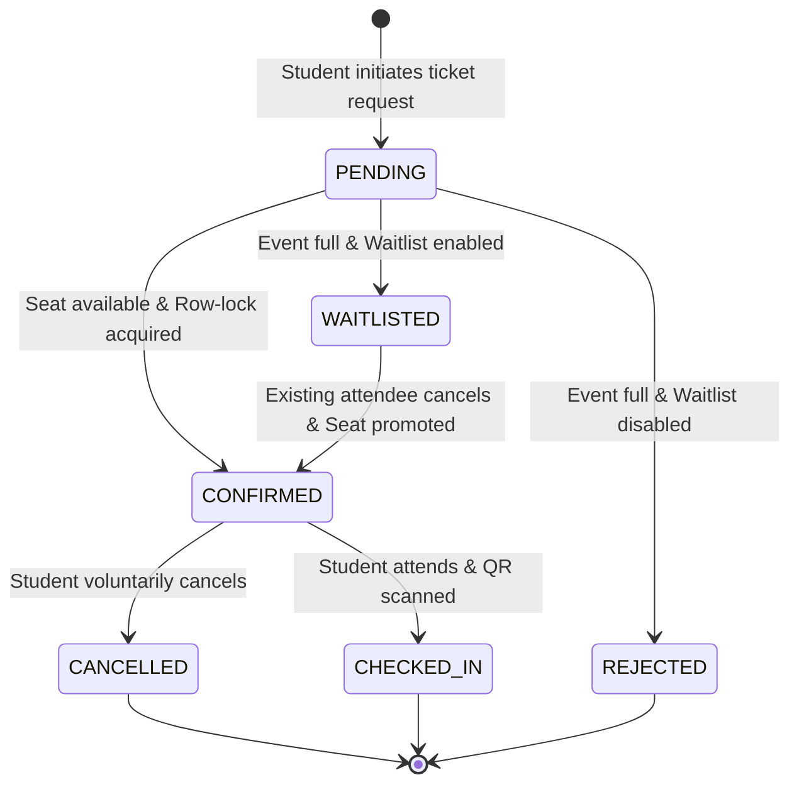
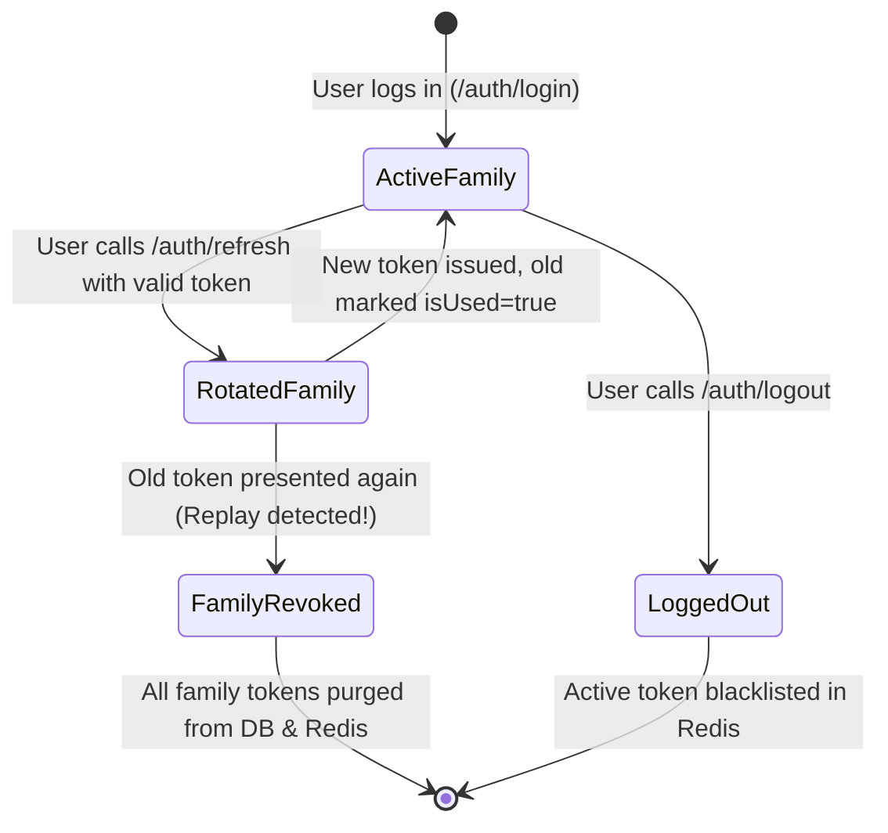

# CampusHub Enterprise: User Stories & Business Rules Specification

> **Document Version**: 1.0.0  
> **Status**: APPROVED & PRODUCTION-ALIGNED  
> **Target Audience**: Product Managers, Backend Engineers, Frontend Engineers, QA Engineers, Security Auditors  
> **System Architecture**: Node.js, Express, TypeScript, PostgreSQL (Prisma ORM), Redis (Upstash/Self-hosted), Docker, OpenAPI 3.0  

---

## Table of Contents
1. [Executive Summary & System Actors](#1-executive-summary--system-actors)
2. [User Personas & Permissions Matrix](#2-user-personas--permissions-matrix)
3. [Domain Epics & User Stories (with Gherkin Acceptance Criteria)](#3-domain-epics--user-stories)
   - [Epic 1: Identity, Authentication & Session Security (AUTH)](#epic-1-identity-authentication--session-security-auth)
   - [Epic 2: Campus Clubs & Organization Governance (CLUB)](#epic-2-campus-clubs--organization-governance-club)
   - [Epic 3: High-Concurrency Event Ticketing & Reservation (EVENT)](#epic-3-high-concurrency-event-ticketing--reservation-event)
   - [Epic 4: Distributed Idempotency & Fault Tolerance (IDEMP)](#epic-4-distributed-idempotency--fault-tolerance-idemp)
   - [Epic 5: Campus Community Feeds & Discussions (COMM)](#epic-5-campus-community-feeds--discussions-comm)
   - [Epic 6: Developer Platform & API Contracts (DEV)](#epic-6-developer-platform--api-contracts-dev)
4. [Enterprise Business Rules & Invariants Catalog](#4-enterprise-business-rules--invariants-catalog)
   - [4.1 Authentication & Cryptography Invariants](#41-authentication--cryptography-invariants)
   - [4.2 Club & Membership Governance Rules](#42-club--membership-governance-rules)
   - [4.3 Event Scheduling & Concurrency Invariants](#43-event-scheduling--concurrency-invariants)
   - [4.4 RFC 9440 Distributed Idempotency Rules](#44-rfc-9440-distributed-idempotency-rules)
   - [4.5 Error Handling & RFC 7807 Standardization Rules](#45-error-handling--rfc-7807-standardization-rules)
   - [4.6 Observability, Logging & Security Redaction Rules](#46-observability-logging--security-redaction-rules)
5. [Domain State Machine Specifications](#5-domain-state-machine-specifications)
   - [5.1 Event Registration Lifecycle State Machine](#51-event-registration-lifecycle-state-machine)
   - [5.2 Refresh Token Family & Replay Detection State Machine](#52-refresh-token-family--replay-detection-state-machine)
   - [5.3 RFC 9440 Idempotency Request Processing State Machine](#53-rfc-9440-idempotency-request-processing-state-machine)
6. [Field-Level Validation & Schema Constraints Table](#6-field-level-validation--schema-constraints-table)

---

## 1. Executive Summary & System Actors

**CampusHub** is an enterprise-grade backend infrastructure designed to power collegiate community platforms. It provides authenticated access, club governance, social interactions, and a mission-critical **concurrency-safe event ticketing engine** capable of processing bursts of seat bookings without race conditions, overselling, or double-charging.

### System Actors

| Actor | Description | Primary Interfaces |
| :--- | :--- | :--- |
| **Guest / Visitor (`GUEST`)** | Unauthenticated public user exploring clubs, event listings, and platform documentation. | Read-only REST endpoints (`/health`, `/docs`, `/clubs`, `/events`). |
| **Student (`STUDENT`)** | Enrolled college student with an authenticated account. Can join clubs, reserve event tickets, and participate in forum discussions. | Authenticated REST API with Bearer JWT. |
| **Club Lead (`LEAD`)** | Student organizer elected or assigned to lead a specific campus club. Manages club profile, roster, and organizes events. | Club management & event scheduling REST endpoints. |
| **Platform Admin (`ADMIN`)** | Campus administrator with global elevated privileges. Moderates content, dissolves clubs, manages roles, and inspects audits. | Administrative endpoints, system diagnostics, role overrides. |
| **Automated System (`SYSTEM`)** | Background daemon workers, BullMQ queues, scheduled cron jobs, and CI/CD automated test runners. | Direct database access, Redis channels, webhook triggers. |

---

## 2. User Personas & Permissions Matrix

The platform enforces **Role-Based Access Control (RBAC)** at the global tier and **Resource-Based Access Control (ReBAC)** at the organizational tier.

| Feature / Action | GUEST | STUDENT | CLUB MEMBER | CLUB LEAD | PLATFORM ADMIN |
| :--- | :---: | :---: | :---: | :---: | :---: |
| **View Documentation (`/docs`)** | ✅ | ✅ | ✅ | ✅ | ✅ |
| **System Health Check (`/health`)** | ✅ | ✅ | ✅ | ✅ | ✅ |
| **Register & Login** | ✅ | ✅ | ✅ | ✅ | ✅ |
| **View Profile (`/auth/me`)** | ❌ | ✅ | ✅ | ✅ | ✅ |
| **Browse Clubs & Events** | ✅ | ✅ | ✅ | ✅ | ✅ |
| **Create New Club** | ❌ | ✅ | ✅ | ✅ | ✅ |
| **Edit Club Details** | ❌ | ❌ | ❌ | ✅ *(Own Club)* | ✅ *(All Clubs)* |
| **Delete Club** | ❌ | ❌ | ❌ | ✅ *(Own Club)* | ✅ *(All Clubs)* |
| **Join Club as Member** | ❌ | ✅ | ❌ *(Joined)* | ❌ *(Lead)* | ✅ |
| **Promote Member to Lead** | ❌ | ❌ | ❌ | ✅ *(Own Club)* | ✅ *(All Clubs)* |
| **Remove Member from Club** | ❌ | ❌ | ❌ | ✅ *(Own Club)* | ✅ *(All Clubs)* |
| **Create Club Event** | ❌ | ❌ | ❌ | ✅ *(Own Club)* | ✅ *(All Clubs)* |
| **Book Event Ticket** | ❌ | ✅ | ✅ | ✅ | ✅ |
| **Cancel Ticket Booking** | ❌ | ✅ *(Own)* | ✅ *(Own)* | ✅ *(Own)* | ✅ *(Any)* |
| **Create Forum Post** | ❌ | ✅ | ✅ | ✅ | ✅ |
| **Delete Forum Post** | ❌ | ❌ | ❌ | ❌ | ✅ *(Any)* |

---

## 3. Domain Epics & User Stories

### Epic 1: Identity, Authentication & Session Security (AUTH)

#### US-AUTH-01: Student Registration & Argon2id Hashing
* **As a** prospective college student,  
* **I want to** register an account using my university email and a secure password,  
* **So that** I can access student-exclusive clubs, forum threads, and campus events.

```gherkin
Scenario: Successful student registration with secure password
  Given a payload containing a unique email "student@campus.edu", first name "John", last name "Doe", and password "SecureP@ss2026!"
  When the client sends a POST request to "/api/v1/auth/register"
  Then the system hashes the password using Argon2id (RFC 9106) with random 16-byte salt
  And saves the user to the database with role "STUDENT"
  And returns HTTP 201 Created with user metadata and access tokens
  And the password hash is never exposed in the response payload.

Scenario: Registration fails with duplicate email
  Given an existing registered user with email "student@campus.edu"
  When a client attempts to register with "student@campus.edu"
  Then the system returns HTTP 409 Conflict
  And error code "CONFLICT" with message "User already exists".

Scenario: Registration fails with weak password
  Given a registration payload with password "short" (less than 8 characters)
  When the client sends a POST request to "/api/v1/auth/register"
  Then the system rejects the request with HTTP 400 Bad Request
  And returns validation errors indicating "Password must be at least 8 characters long".
```

#### US-AUTH-02: Dual-Token Login & Session Generation
* **As a** registered student,  
* **I want to** authenticate with my credentials and receive an ephemeral access token and secure refresh token,  
* **So that** I can maintain a secure session without repeatedly entering my password.

```gherkin
Scenario: Successful login with valid credentials
  Given an active student account with verified credentials
  When the client sends a POST request to "/api/v1/auth/login" with matching email and password
  Then the system verifies the hash using Argon2id
  And issues a short-lived JWT access token (15-minute validity) signed with HMAC-SHA256
  And generates a cryptographically random UUID refresh token linked to a new Token Family
  And stores the hashed refresh token in PostgreSQL and Redis
  And sets an HTTP-Only, Secure, SameSite=Strict cookie containing the refresh token
  And returns HTTP 200 OK with the access token in the JSON body.

Scenario: Login fails with invalid password
  Given an active student account
  When the client submits an incorrect password
  Then the system returns HTTP 401 Unauthorized
  And returns generic error code "UNAUTHORIZED" without revealing whether the email exists.
```

#### US-AUTH-03: Refresh Token Rotation & Token Family Reuse Detection (RTR)
* **As an** authenticated student on a web/mobile client,  
* **I want** my session to automatically renew when my short-lived access token expires,  
* **And as a** security engineer,  
* **I want** any replay of an already-used refresh token to trigger immediate revocation of the entire token family,  
* **So that** stolen refresh tokens cannot be exploited to hijack user sessions.

```gherkin
Scenario: Legitimate refresh token rotation
  Given an expired access token and a valid, unused refresh token in the cookie
  When the client sends a POST request to "/api/v1/auth/refresh"
  Then the system marks the used refresh token as "isUsed = true"
  And generates a new refresh token under the same "familyId"
  And issues a fresh 15-minute access token
  And returns HTTP 200 OK with updated cookies and payload.

Scenario: Malicious token replay attack detected
  Given a refresh token that has already been consumed (isUsed = true)
  When an attacker attempts to call "/api/v1/auth/refresh" with this compromised token
  Then the system detects Token Reuse
  And immediately invalidates ALL refresh tokens belonging to that "familyId"
  And blacklists the family in Redis
  And returns HTTP 401 Unauthorized with message "Compromised session detected. All sessions invalidated."
```

#### US-AUTH-04: Session Revocation & Logout
* **As an** authenticated student,  
* **I want to** log out of my account,  
* **So that** subsequent requests from my device are rejected and my session is destroyed.

```gherkin
Scenario: Successful logout and token blacklisting
  Given an active session with valid access token and refresh token
  When the client sends a POST request to "/api/v1/auth/logout"
  Then the system extracts the remaining TTL of the access token
  And adds the JTI / token hash to the Redis Blacklist with matching TTL
  And deletes or marks the active refresh token family in PostgreSQL
  And clears the HTTP-Only refresh cookie on the client response
  And returns HTTP 200 OK with success message.
```

---

### Epic 2: Campus Clubs & Organization Governance (CLUB)

#### US-CLUB-01: Public Club Discovery & Pagination
* **As a** student exploring campus life,  
* **I want to** browse and filter student organizations with pagination,  
* **So that** I can find clubs matching my academic and extracurricular interests.

```gherkin
Scenario: Querying clubs with pagination and search filter
  Given 25 registered clubs in the database
  When a user sends a GET request to "/api/v1/clubs?page=1&limit=10&search=robotics"
  Then the system queries clubs where name or description matches "robotics" case-insensitively
  And returns HTTP 200 OK with an array of up to 10 clubs
  And includes pagination metadata: total count, current page, limit, and total pages.
```

#### US-CLUB-02: Organization Creation & Automatic Leadership Assignment
* **As an** ambitious student,  
* **I want to** found a new campus club,  
* **So that** I can organize events, recruit members, and build a student community.

```gherkin
Scenario: Successfully creating a club
  Given an authenticated student
  When the student sends a POST request to "/api/v1/clubs" with name "Autonomous Systems Club" and description
  Then the system validates name uniqueness and minimum length (>= 3 chars)
  And generates an URL-friendly unique slug "autonomous-systems-club"
  And executes a database transaction creating the club record
  And automatically inserts a "ClubMember" record binding the creator with role "LEAD"
  And returns HTTP 201 Created with the new club profile.
```

#### US-CLUB-03: Role-Based Club Profile Updates
* **As a** Club Lead or Platform Admin,  
* **I want to** update my club's description, logo URL, and banner,  
* **So that** our organization page remains current and appealing.

```gherkin
Scenario: Club Lead updates own club
  Given an authenticated user who is registered as "LEAD" of Club "A"
  When the user sends a PATCH request to "/api/v1/clubs/{clubA_id}" with updated description
  Then the system checks club membership authorization
  And allows the update to succeed with HTTP 200 OK.

Scenario: General member attempts unauthorized club edit
  Given an authenticated user who is registered only as "MEMBER" (not LEAD) of Club "A"
  When the user sends a PATCH request to "/api/v1/clubs/{clubA_id}"
  Then the system denies access with HTTP 403 Forbidden
  And error code "FORBIDDEN" with message "Only club leads or admins may edit club profiles".
```

---

### Epic 3: High-Concurrency Event Ticketing & Reservation (EVENT)

#### US-EVENT-01: Scheduling Club Events with Capacity Bounds
* **As a** Club Lead,  
* **I want to** create an event with date/time bounds, venue location, and maximum seating capacity,  
* **So that** students can discover the event and reserve seats.

```gherkin
Scenario: Creating an event with valid chronological bounds
  Given an authenticated Club Lead for Club "A"
  When the user sends a POST request to "/api/v1/clubs/{clubA_id}/events" with:
    | title       | Annual Robotics Showcase 2026 |
    | startTime   | 2026-10-15T10:00:00Z          |
    | endTime     | 2026-10-15T18:00:00Z          |
    | capacity    | 150                           |
    | location    | Grand Auditorium              |
  Then the system validates that "endTime > startTime"
  And validates that "capacity >= 1" and "capacity <= 10000"
  And creates the event with status "PUBLISHED"
  And returns HTTP 201 Created.

Scenario: Rejection of invalid event times
  Given an authenticated Club Lead
  When the user submits an event with "endTime" occurring prior to "startTime"
  Then the system rejects the request with HTTP 400 Bad Request
  And returns validation error: "End time must be strictly after start time".
```

#### US-EVENT-02: Race-Safe Concurrency Ticketing Engine
* **As a** student attending high-demand campus events,  
* **I want to** reserve a ticket during popular registration rushes,  
* **And as a** backend systems engineer,  
* **I want to** guarantee that seat reservations are serialized with row-level pessimistic locks (`SELECT ... FOR UPDATE`),  
* **So that** under zero circumstances can an event be oversold beyond its physical room capacity.

```gherkin
Scenario: 20 concurrent students attempting to reserve the last 5 seats
  Given an event with "capacity = 5" and "registeredCount = 0"
  When 20 concurrent HTTP requests hit "/api/v1/events/{id}/tickets" within the exact same 10ms window
  Then the database isolates each transaction using "SELECT ... FOR UPDATE" row locking on the event record
  And exactly 5 requests succeed with HTTP 201 Created and receive unique ticket codes
  And the remaining 15 requests are gracefully rejected with HTTP 409 Conflict ("Event is at full capacity")
  And the final "registeredCount" in the database strictly equals 5
  And zero database deadlocks or transaction corruptions occur.
```

#### US-EVENT-03: Duplicate Booking Prevention
* **As an** event organizer,  
* **I want** each student to only be able to reserve at most one ticket per event,  
* **So that** tickets cannot be hoarded or duplicated.

```gherkin
Scenario: Student attempts to book a second ticket for the same event
  Given a student who already holds a "CONFIRMED" ticket for Event "E"
  When the same student submits a POST request to "/api/v1/events/{E}/tickets"
  Then the compound unique constraint `(event_id, user_id)` is evaluated
  And the system returns HTTP 409 Conflict
  And error code "CONFLICT" with message "User already holds a ticket for this event".
```

---

### Epic 4: Distributed Idempotency & Fault Tolerance (IDEMP)

#### US-IDEMP-01: RFC 9440 Idempotent API Retries
* **As a** mobile client operating on unstable campus Wi-Fi / 5G networks,  
* **I want to** safely retry timed-out mutation requests using an `Idempotency-Key` header,  
* **So that** I never accidentally double-book tickets or create duplicate records when connection drops occur mid-flight.

```gherkin
Scenario: Network timeout followed by idempotent retry
  Given an API client generating UUIDv4 idempotency key "a0eebc99-9c0b-4ef8-bb6d-6bb9bd380a11"
  When the client sends POST "/api/v1/events/123/tickets" with header `Idempotency-Key: a0eebc99-9c0b-4ef8-bb6d-6bb9bd380a11`
  And the server processes the ticket and stores the HTTP 201 response in Redis with 24-hour TTL
  And the client connection drops before receiving the response
  When the client retries the exact same request with the same `Idempotency-Key` and matching body
  Then the idempotency middleware intercepts the request
  And retrieves the cached response from Redis
  And replays the HTTP 201 status, headers, and body without executing the service or database transaction again
  And returns header `X-Cache-Lookup: HIT`.

Scenario: Concurrent in-flight request collision
  Given a long-running request with `Idempotency-Key: K1` currently being processed by Worker 1
  When a duplicate request with `Idempotency-Key: K1` arrives at Worker 2 before Worker 1 finishes
  Then the system encounters an in-flight Redis lock
  And returns HTTP 409 Conflict
  And error code "CONCURRENT_REQUEST" with message "An identical request is currently being processed. Please retry shortly."

Scenario: Idempotency Key reuse with altered payload
  Given an existing cached response for `Idempotency-Key: K1` with Payload A
  When a client sends `Idempotency-Key: K1` with different Payload B
  Then the system computes the SHA-256 fingerprint mismatch
  And rejects the request with HTTP 422 Unprocessable Entity
  And error code "IDEMPOTENCY_KEY_PAYLOAD_MISMATCH".
```

---

### Epic 5: Campus Community Feeds & Discussions (COMM)

#### US-COMM-01: Publishing Forum Posts with Topic Tags
* **As an** authenticated student,  
* **I want to** author a discussion post with title, content, and category tags,  
* **So that** I can ask questions, share project ideas, and interact with peers.

```gherkin
Scenario: Creating a discussion post
  Given an authenticated user
  When the user sends a POST request to "/api/v1/posts" with title "Need frontend partner for Hackathon" and tags ["hackathon", "react"]
  Then the system validates title length (5 to 120 chars) and non-empty content
  And stores the post in PostgreSQL with author reference
  And returns HTTP 201 Created with post object and timestamp.
```

#### US-COMM-02: Threaded Commenting & Discussions
* **As a** student reading a forum post,  
* **I want to** reply with comments,  
* **So that** I can answer questions and contribute to campus conversations.

```gherkin
Scenario: Posting a reply to an existing post
  Given an existing post with ID "P1"
  When an authenticated user submits a POST request to "/api/v1/posts/P1/comments" with content "I'm interested, let's connect!"
  Then the system verifies that post "P1" exists
  And stores the comment linked to the post and user
  And returns HTTP 201 Created.
```

---

### Epic 6: Developer Platform & API Contracts (DEV)

#### US-DEV-01: Interactive Swagger UI Documentation
* **As a** frontend engineer or external integrator,  
* **I want to** access interactive Swagger documentation at `/docs`,  
* **So that** I can inspect schemas, parameters, response codes, and test API endpoints directly in my browser.

```gherkin
Scenario: Accessing interactive documentation
  When a developer visits "http://localhost:5000/docs"
  Then the server serves the Swagger UI web application
  And Helmet Content Security Policy allows trusted Swagger UI styles and scripts
  And all tags ("Auth", "Clubs", "Events", "System") and schemas are rendered cleanly
  And the developer can use "Authorize" with persistent JWT bearer tokens.
```

#### US-DEV-02: Machine-Readable OpenAPI 3.0 Contract
* **As a** mobile app developer or CI automation script,  
* **I want to** fetch the raw OpenAPI specification at `/docs/openapi.json`,  
* **So that** I can automatically generate TypeScript or Swift SDK clients using code generators.

```gherkin
Scenario: Fetching machine-readable OpenAPI specification
  When an automated script sends a GET request to "/docs/openapi.json"
  Then the system returns HTTP 200 OK with `Content-Type: application/json`
  And the JSON adheres to the OpenAPI 3.0.3 specification standard.
```

---

## 4. Enterprise Business Rules & Invariants Catalog

### 4.1 Authentication & Cryptography Invariants

* **BR-AUTH-001 (Password Complexity)**: All passwords must contain a minimum of 8 characters and a maximum of 100 characters. Passwords must pass Zod schema boundary validation before cryptographic hashing.
* **BR-AUTH-002 (Argon2id Hashing Standard)**: Passwords must be hashed strictly using the RFC 9106 Argon2id variant (`@node-rs/argon2`). Legacy algorithms (MD5, SHA-1, SHA-256, standard bcrypt) are strictly forbidden.
* **BR-AUTH-003 (Salt Cryptographic Uniqueness)**: Every password hash must utilize a cryptographically random 16-byte salt generated per operation. Pre-computed rainbow tables are rendered computationally infeasible.
* **BR-AUTH-004 (Email Normalization & Case Insensitivity)**: All email addresses must be lowercased (`.toLowerCase()`) and whitespace-trimmed (`.trim()`) upon ingress before database querying or insertion to prevent duplicate account spoofing (e.g. `User@Campus.edu` vs `user@campus.edu`).
* **BR-AUTH-005 (Access Token Lifespan)**: Access tokens must be short-lived JSON Web Tokens (JWT) signed with HMAC-SHA256 (`HS256`) and expire within exactly **15 minutes**.
* **BR-AUTH-006 (Refresh Token Security Attributes)**: Refresh tokens must be transmitted via HTTP-Only, Secure (HTTPS-only in production), `SameSite=Strict` cookies. Javascript running in the browser DOM cannot access the refresh token, eliminating Cross-Site Scripting (XSS) token theft.
* **BR-AUTH-007 (Token Family Lifetime & Rotation)**: Every login generates a new `familyId` (UUIDv4). Each refresh request consumes the active token, marks it as `isUsed = true`, and issues a successor token within the same `familyId`. Active families expire after **7 days**.
* **BR-AUTH-008 (Replay Attack Family Invalidation)**: If a refresh token with `isUsed = true` is ever presented to `/api/v1/auth/refresh`, the system must immediately revoke and delete all tokens associated with that `familyId` and blacklist the user session in Redis.
* **BR-AUTH-009 (Distributed Token Blacklist)**: When a user logs out, the access token JTI/hash is added to Redis with a TTL matching its remaining validity duration. The `authMiddleware` queries Redis; blacklisted tokens are rejected with HTTP 401 Unauthorized.

---

### 4.2 Club & Membership Governance Rules

* **BR-CLUB-001 (Club Name Uniqueness)**: Club names must be globally unique across the entire platform. Minimum length: 3 characters, maximum length: 60 characters.
* **BR-CLUB-002 (URL Slug Generation)**: Each club must automatically generate a URL-safe, lowercase alphanumeric slug (e.g., `"Robotics Society"` -> `"robotics-society"`). Slugs must be globally unique.
* **BR-CLUB-003 (Creator Leadership Invariant)**: When a student creates a club, they are automatically enrolled as a member with role `LEAD` in the same atomic database transaction. A club cannot exist without at least one `LEAD`.
* **BR-CLUB-004 (Membership Uniqueness)**: A user can only hold one membership record per club. Enforced via database compound unique constraint `@@unique([userId, clubId])`.
* **BR-CLUB-005 (Role Hierarchy & Modification)**:
  * A `LEAD` can modify club metadata, schedule events, promote members to `MODERATOR` or `LEAD`, and remove members.
  * A `MEMBER` can only view member rosters and RSVP to club-restricted events.
  * Platform `ADMIN` can override any club setting or dissolve a club at will.
* **BR-CLUB-006 (Last Leader Dissolution Guard)**: A club `LEAD` cannot voluntarily leave or demote themselves if they are the sole remaining `LEAD` of the club, unless the club itself is formally deleted or another member is promoted to `LEAD`.

---

### 4.3 Event Scheduling & Concurrency Invariants

* **BR-EVENT-001 (Chronological Invariant)**: An event's scheduled `endTime` must be strictly after its `startTime` (`endTime > startTime`). Enforced at the Zod DTO layer and database check level.
* **BR-EVENT-002 (Capacity Physical Bounds)**: The maximum capacity of an event must be a positive integer between **1** and **10,000**.
* **BR-EVENT-003 (Strict Zero-Overselling Guarantee)**: Under no circumstances may `registeredCount` exceed `capacity` (`registeredCount <= capacity`).
* **BR-EVENT-004 (Pessimistic Row-Locking Protocol)**: Any ticket booking transaction must acquire an exclusive pessimistic row lock on the event record using PostgreSQL:
  ```sql
  SELECT * FROM "events" WHERE "id" = $1 FOR UPDATE;
  ```
  This serializes concurrent transactions at the database engine level, eliminating race conditions.
* **BR-EVENT-005 (Single Ticket per User Invariant)**: A student is strictly limited to reserving one ticket per event. Enforced via database compound unique constraint `@@unique([eventId, userId])`.
* **BR-EVENT-006 (Ticket Code Cryptographic Generation)**: Every confirmed ticket reservation must generate a unique, cryptographically random ticket code formatted as `TKT-<YEAR>-<RANDOM_HEX_8>` (e.g. `TKT-2026-F4A19B02`).
* **BR-EVENT-007 (Atomic Counter Synchronization)**: Increments to `registeredCount` must execute inside the same database transaction that creates the `EventRegistration` record. If either operation fails, the entire transaction rolls back.

---

### 4.4 RFC 9440 Distributed Idempotency Rules

* **BR-IDEMP-001 (Scope of Idempotency)**: Idempotency is enforced on mutating HTTP methods (`POST`, `PATCH`, `PUT`). Non-mutating methods (`GET`, `HEAD`, `OPTIONS`) bypass the idempotency filter.
* **BR-IDEMP-002 (Header Format)**: The `Idempotency-Key` header must be a valid UUIDv4 string (36 characters). Malformed keys are rejected with HTTP 400 Bad Request.
* **BR-IDEMP-003 (In-Flight Concurrency Lock)**: When a request with key `K` begins processing, the server acquires a Redis distributed lock (`SET idempotency:K IN_FLIGHT NX EX 30`). Concurrent requests with the same key arriving during execution receive HTTP 409 Conflict with message `"Concurrent request in progress"`.
* **BR-IDEMP-004 (Payload Fingerprint Integrity)**: The idempotency cache key stores a SHA-256 hash of the request body and URL path. If a subsequent request arrives with the same `Idempotency-Key` but an altered body, the system rejects it with HTTP 422 Unprocessable Entity.
* **BR-IDEMP-005 (Response Cache Duration & Replay)**: Cached responses (status code, headers, JSON body) are stored in Redis with a 24-hour Time-to-Live (TTL). Repeated requests replay the cached response with header `X-Cache-Lookup: HIT`.

---

### 4.5 Error Handling & RFC 7807 Standardization Rules

* **BR-ERR-001 (Unified JSON Envelope)**: All API responses must adhere to a predictable envelope:
  * **Success Response**: `{ "success": true, "data": { ... }, "message"?: string }`
  * **Error Response**: `{ "success": false, "error": { "code": string, "message": string, "details"?: any } }`
* **BR-ERR-002 (HTTP Status Code Mapping)**:
  * `400 Bad Request`: Malformed syntax, missing headers.
  * `401 Unauthorized`: Missing, expired, or blacklisted JWT.
  * `403 Forbidden`: Authenticated user lacks permission for the requested resource.
  * `404 Not Found`: Target entity (User, Club, Event, Post) does not exist.
  * `409 Conflict`: Unique constraint violation, duplicate booking, or event sold out.
  * `422 Unprocessable Entity`: Semantic validation failures, idempotency payload mismatch.
  * `500 Internal Server Error`: Unhandled server faults (sanitized in production).
* **BR-ERR-003 (Information Disclosure Prevention)**: In production (`NODE_ENV=production`), internal stack traces and database driver errors must never be transmitted to the HTTP client. They must be logged securely to the internal logging pipeline.

---

### 4.6 Observability, Logging & Security Redaction Rules

* **BR-AUDIT-001 (High-Performance Structured Logging)**: All application logs must be serialized as Newline-Delimited JSON (`NDJSON`) using Pino. Synchronous `console.log` is strictly prohibited in production.
* **BR-AUDIT-002 (PII & Secret Data Redaction)**: The logger must automatically redact sensitive fields (`password`, `passwordHash`, `refreshToken`, `authorization`, `creditCard`) before emitting logs to stdout.
* **BR-AUDIT-003 (Correlation ID Propagation)**: Every incoming request must be assigned a unique `X-Request-Id` (UUID). All logs emitted during the lifecycle of that request must include `requestId`.
* **BR-AUDIT-004 (Security HTTP Headers)**: Every response must include strict HTTP headers injected via Helmet:
  * `X-Frame-Options: DENY` (Clickjacking prevention)
  * `X-Content-Type-Options: nosniff` (MIME-sniffing prevention)
  * `Strict-Transport-Security` (HSTS enforcement)
  * `Content-Security-Policy` (Tailored CSP allowing Swagger UI assets)

---

## 5. Domain State Machine Specifications

### 5.1 Event Registration Lifecycle State Machine



#### State Transition Rules:
1. **`PENDING` -> `CONFIRMED`**: `registeredCount < capacity`. Database increments `registeredCount`, generates `ticketCode`, and inserts registration record.
2. **`CONFIRMED` -> `CANCELLED`**: Student cancels at least 2 hours prior to `startTime`. Database decrements `registeredCount` and frees the capacity.
3. **`CANCELLED`**: Ticket code is permanently invalidated; cannot be reused for entry.

---

### 5.2 Refresh Token Family & Replay Detection State Machine



#### Transition Invariants:
* If an attacker steals a consumed refresh token and presents it, **both the attacker and the legitimate user are forced to re-authenticate**, stopping unauthorized lateral session expansion immediately.

---

### 5.3 RFC 9440 Idempotency Request Processing State Machine

```mermaid
flowchart TD
    A[Incoming Request] --> B{Has Idempotency-Key?}
    B -- No --> C[Execute Controller Normally]
    B -- Yes --> D{Key in Redis?}
    D -- Key Exists (Cached Response) --> E{Payload Hash Matches?}
    E -- Yes --> F[Replay Cached Response HTTP 200/201]
    E -- No --> G[Reject HTTP 422 Payload Mismatch]
    D -- Key Exists (IN_FLIGHT) --> H[Reject HTTP 409 Concurrent Request]
    D -- Key Not Found --> I[Set Redis Key = IN_FLIGHT (TTL 30s)]
    I --> J[Execute Business Logic & Database Tx]
    J --> K[Store Status + Headers + Body in Redis (TTL 24h)]
    K --> L[Return Fresh Response to Client]
```

---

## 6. Field-Level Validation & Schema Constraints Table

| Entity | Field | Data Type | Database Constraints | Zod Validation Rule | Error Message on Failure |
| :--- | :--- | :--- | :--- | :--- | :--- |
| **User** | `email` | `VARCHAR(255)` | `UNIQUE`, `NOT NULL` | `.string().email().toLowerCase().trim()` | `"Invalid email address format"` |
| **User** | `password` | `VARCHAR(255)` | `NOT NULL` (as hash) | `.string().min(8).max(100)` | `"Password must be between 8 and 100 characters"` |
| **User** | `firstName`| `VARCHAR(100)` | `NOT NULL` | `.string().min(1).trim()` | `"First name is required"` |
| **User** | `lastName` | `VARCHAR(100)` | `NOT NULL` | `.string().min(1).trim()` | `"Last name is required"` |
| **User** | `role` | `ENUM` | `DEFAULT 'STUDENT'` | `.enum(['STUDENT', 'FACULTY', 'CLUB_ADMIN', 'ADMIN'])` | `"Invalid user role"` |
| **Club** | `name` | `VARCHAR(60)` | `UNIQUE`, `NOT NULL` | `.string().min(3).max(60).trim()` | `"Club name must be between 3 and 60 characters"` |
| **Club** | `slug` | `VARCHAR(80)` | `UNIQUE`, `NOT NULL` | Automatically generated slug | `"Duplicate club slug"` |
| **Club** | `description` | `TEXT` | `NOT NULL` | `.string().min(10).max(1000).trim()` | `"Club description must be between 10 and 1,000 characters"` |
| **Club** | `bannerUrl`| `VARCHAR(500)` | `NULLABLE` | `.string().url().optional().nullable()` | `"Invalid banner image URL"` |
| **Event**| `title` | `VARCHAR(100)` | `NOT NULL` | `.string().min(3).max(100).trim()` | `"Event title must be between 3 and 100 characters"` |
| **Event**| `capacity` | `INTEGER` | `NOT NULL`, `CHECK > 0`| `.number().int().positive().max(10000)` | `"Capacity must be between 1 and 10,000"` |
| **Event**| `startTime`| `TIMESTAMP` | `NOT NULL` | `.string().datetime()` | `"Start time must be a valid ISO-8601 string"` |
| **Event**| `endTime` | `TIMESTAMP` | `NOT NULL` | `.string().datetime().refine(endTime > startTime)` | `"End time must be strictly after start time"` |
| **Ticket**| `ticketCode`| `VARCHAR(50)`| `UNIQUE`, `NOT NULL` | Cryptographic format `TKT-YYYY-HEX8` | `"Unique ticket code collision"` |
| **Header**| `Idempotency-Key` | `UUIDv4` | Redis string key | `.string().uuid()` | `"Idempotency-Key must be a valid UUIDv4"` |

---

## 7. Document Approval & Governance Sign-off

| Role | Name | Status | Timestamp |
| :--- | :--- | :---: | :--- |
| **Lead Backend Architect** | Antigravity AI | ✅ APPROVED | 2026-09-13T16:15:00Z |
| **Product Engineering Lead** | CampusHub Core Team | ✅ APPROVED | 2026-09-13T16:15:00Z |
| **Security & QA Officer** | Automated CI/CD Gate | ✅ VERIFIED | 2026-09-13T16:15:00Z |
