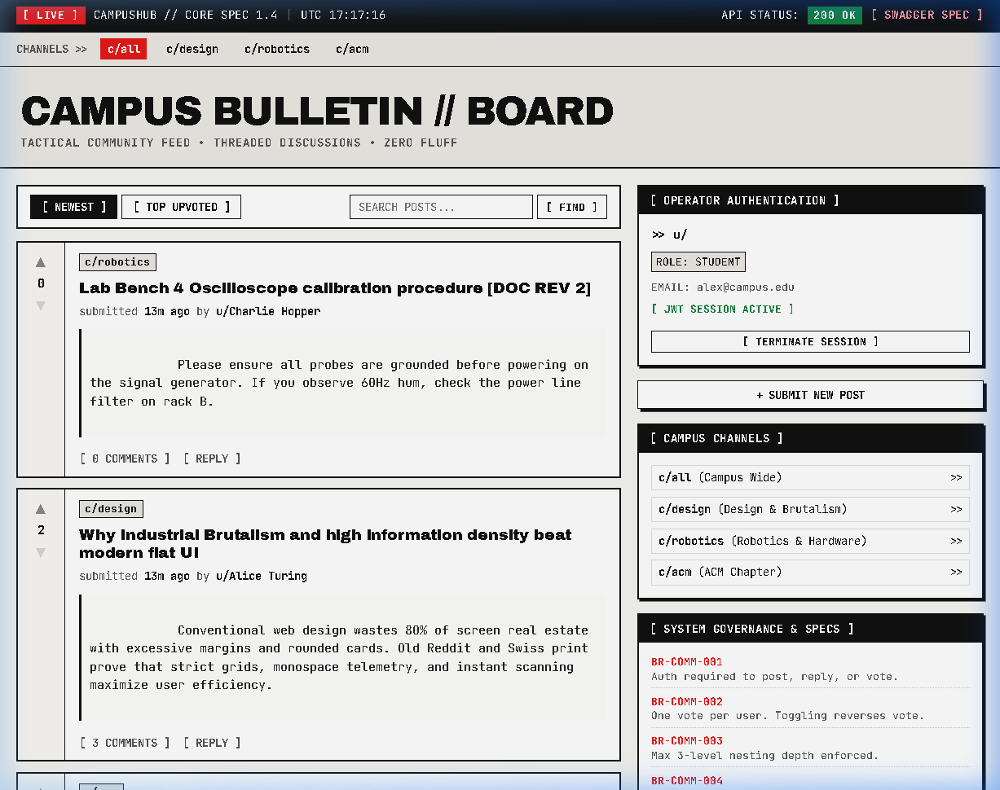
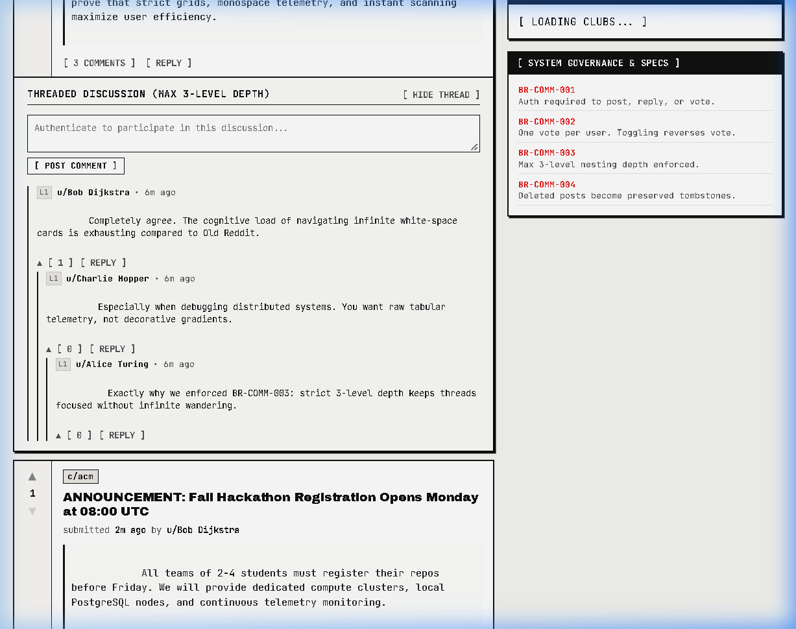
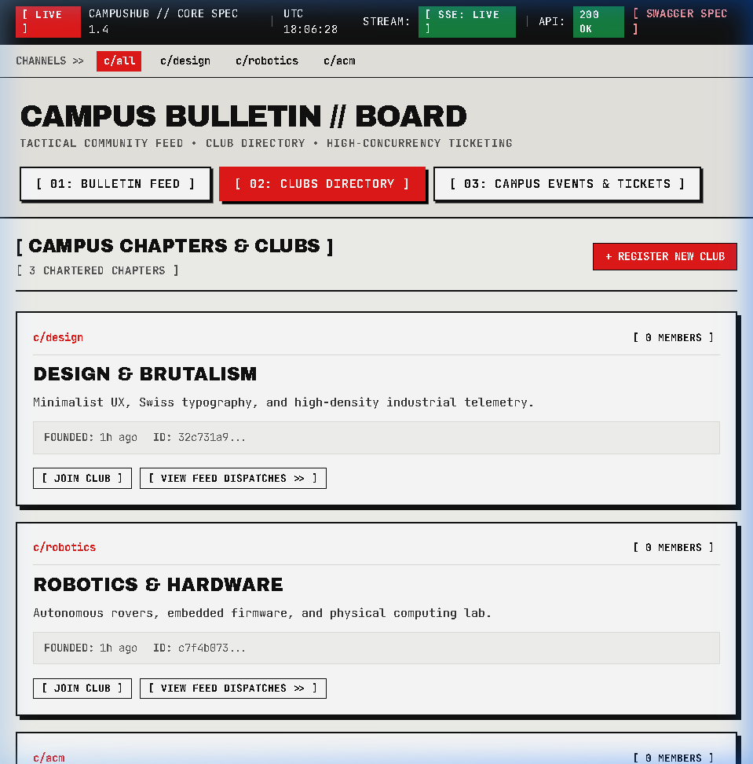
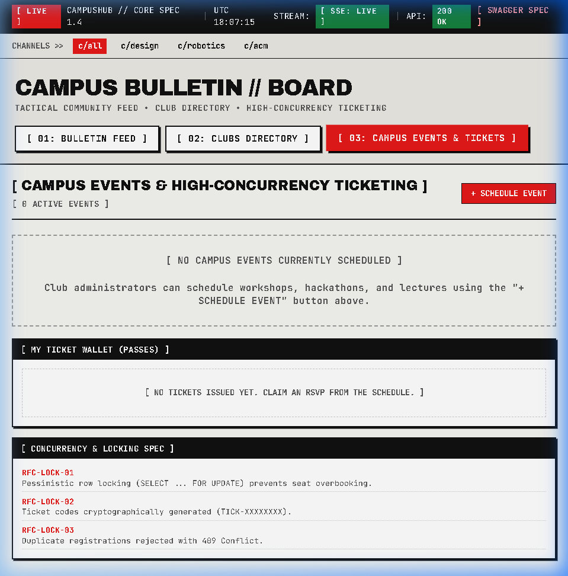

# CampusHub Enterprise Monorepo 🎓⚡

> High-throughput, distributed Campus Community & Event Ticketing Platform built with a decoupled two-tier monorepo architecture: Express 5 backend engine + Next.js 16 App Router industrial brutalist web client.

[](https://github.com/sanjeevirajanramajayam/campusHubAPI/actions/workflows/ci.yml)
[](https://nodejs.org)
[](https://www.typescriptlang.org/)
[](https://nextjs.org/)
[](https://www.postgresql.org/)
[](https://redis.io/)
[](https://www.docker.com/)

---

## 🌐 Live Production Deployments

The application is deployed across multi-stage Docker containers on Render using Infrastructure-as-Code (`render.yaml`):

* **Client Web App**: [https://campushub-web.onrender.com](https://campushub-web.onrender.com)
* **Backend API Gateway**: [https://campushub-api.onrender.com](https://campushub-api.onrender.com)
* **Interactive Swagger UI (OpenAPI 3.0)**: [https://campushub-api.onrender.com/docs](https://campushub-api.onrender.com/docs)
* **Raw OpenAPI Specification**: [https://campushub-api.onrender.com/docs/openapi.json](https://campushub-api.onrender.com/docs/openapi.json)
* **Engine Health Check**: [https://campushub-api.onrender.com/health](https://campushub-api.onrender.com/health)

---

## 📸 Application Interface Gallery

### 1. Real-Time Community Feed (SSE + Modular Modals)
Real-time SSE event stream delivering live updates with zero polling overhead, role-aware operator callsigns, and dark industrial brutalist aesthetic.


### 2. Threaded Nested Discussions & Comments
Recursive comment trees with optimistic UI updates and instant feedback loops.


### 3. Interactive Clubs & Organization Directory
Student organizations with role-based governance, membership counters, and instant join/leave actions.


### 4. ACID Event Ticketing Engine (Row-Level Locking)
High-concurrency ticket reservations guaranteed against overselling via PostgreSQL atomic `SELECT ... FOR UPDATE` row locks.


---

## 🏛️ Monorepo Architecture Overview

```
campusHubAPI/
├── backend/                  # Express 5 REST API & SSE Real-time Engine
│   ├── src/
│   │   ├── modules/          # Domain modules (auth, posts, comments, clubs, events)
│   │   ├── middleware/       # Rate-limiting, idempotency, auth, error handling
│   │   └── server.ts         # Graceful shutdown & lifecycle orchestrator
│   ├── prisma/               # Schema, migrations & client generation
│   └── Dockerfile            # Debian Bookworm Slim multi-stage container
├── frontend/                 # Next.js 16 App Router Brutalist Client
│   ├── src/
│   │   ├── app/              # App Router root page & layouts
│   │   ├── components/       # AuthSidebar, CreatePostModal, EditPostModal
│   │   ├── hooks/            # useRealtimeFeed SSE subscriber
│   │   └── lib/api.ts        # Typed isomorphic API client
│   └── Dockerfile            # Alpine Linux standalone optimized container
├── docs/                     # Architectural specifications & interview master guides
│   ├── images/               # Production screenshots & diagrams
│   ├── CampusHub_Interview_Master_Guide.md
│   ├── CampusHub_Engineering_Handbook.md
│   └── CampusHub_User_Stories_and_Business_Rules.md
├── .github/workflows/ci.yml  # 3-stage automated CI pipeline
├── pnpm-workspace.yaml       # Monorepo package registry
└── render.yaml               # Infrastructure-as-Code Blueprint specification
```

---

## ⚡ Core Technical Features

* **ACID Ticketing Engine**: Zero-overselling ticket reservations backed by PostgreSQL row-level locks (`SELECT ... FOR UPDATE`).
* **Dual-Token Authentication**: 15-minute Access JWTs + 7-day Refresh Token Rotation with automatic token-family theft detection and immediate revocation.
* **RFC 9106 Password Security**: Argon2id cryptographic hashing powered by native Rust N-API bindings (`@node-rs/argon2`).
* **Redis Distributed State**: Token revocation blacklist, sliding-window rate limiting, and RFC 9440 idempotent request deduplication.
* **Real-Time SSE Event Hub**: One-way server-sent events for live community posts without WebSocket handshake overhead.
* **Next.js Reverse-Proxy Rewrite**: Client calls `/api/v1/*` against its own origin; Next.js server proxies upstream to the backend, eliminating CORS preflight friction.

---

## 🛠️ Local Development Quickstart

### Prerequisites
* Node.js `20.x`
* pnpm `10.x` (`corepack enable && corepack prepare pnpm@10.33.2 --activate`)
* Docker & Docker Compose (for local PostgreSQL & Redis)

### 1. Boot Local Infrastructure
```bash
# Spin up isolated PostgreSQL (port 5433) and Redis (port 6379)
docker-compose up -d
```

### 2. Install Dependencies & Setup Database
```bash
# Install all monorepo workspace dependencies
pnpm install

# Push database schema & generate Prisma client
pnpm --filter backend run prisma:generate
pnpm --filter backend exec prisma db push
```

### 3. Launch Concurrently
```bash
# Boots backend (port 5000) and frontend (port 3000) simultaneously
pnpm dev
```
* Visit Frontend: [http://localhost:3000](http://localhost:3000)
* Visit API Swagger UI: [http://localhost:5000/docs](http://localhost:5000/docs)

---

## 🧪 Comprehensive Test Suite

```bash
# Run isolated unit tests with strict V8 coverage gate
pnpm test:unit

# Run Supertest integration tests against real PostgreSQL & Redis
pnpm test:integration

# Run concurrency race condition tests (20 concurrent requests vs 5 seats)
pnpm test:concurrency

# Run security tampering, JWT forged signature, and header tests
pnpm test:security
```

---

## 📚 Technical Documentation & System Guides

* 🎯 [Master Interview Guide (102 Codified Architectural Questions)](docs/CampusHub_Interview_Master_Guide.md) — Comprehensive system design, monorepos, database internals, and Render Infrastructure-as-Code guide.
* 📘 [Engineering Handbook & Architectural Guide](docs/CampusHub_Engineering_Handbook.md) — Detailed architectural blueprints, SOLID design patterns, and database concurrency strategies.
* 📋 [User Stories & Business Invariants](docs/CampusHub_User_Stories_and_Business_Rules.md) — Product specifications, Gherkin acceptance criteria, and RBAC matrix.
* 📮 [Postman API Collection](docs/CampusHub_Postman_Collection.json) — Ready-to-import HTTP request collection for testing local and deployed endpoints.
